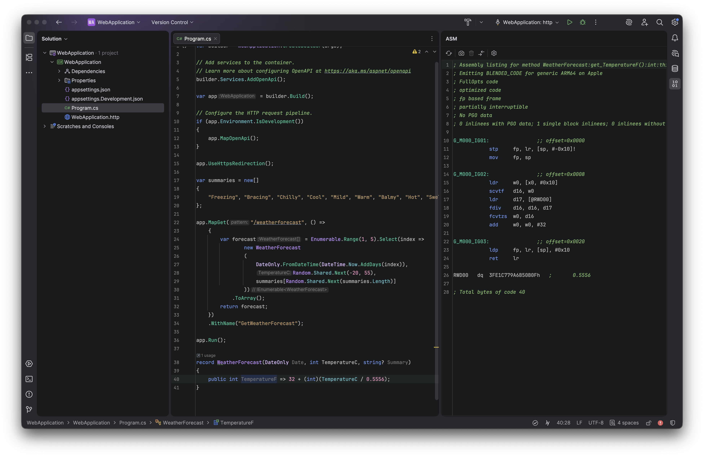

# .NET Disassembler for Rider

<!-- Plugin description: intro -->
View disassembly from C# methods generated by JIT, ReadyToRun, and NativeAOT compilers.
<!-- Plugin description end: intro -->

<!-- Plugin description: features -->
## Features

- View disassembly for any C# method, property, constructor, or type
- Multiple codegen modes: standard JIT, ReadyToRun (crossgen2), and NativeAOT (ilc)
- Snapshot and diff view to compare assembly output after code changes
- Configurable compiler settings: tiered compilation, PGO, and diff-friendly output
- Syntax highlighting for x86/x64 and ARM64 assembly
<!-- Plugin description end: features -->

## Installation

**From JetBrains Marketplace:**
1. Open Rider
2. Go to `Settings` → `Plugins` → `Marketplace`
3. Search for [.NET Disassembler](https://plugins.jetbrains.com/plugin/PLUGIN_ID)
4. Click `Install` and restart Rider

<!-- Plugin description: usage -->
## Usage

1. Open any C# file in a .NET 6.0+ project
2. Place the caret on a method, property, constructor, or type declaration you want to analyze
3. Open the disassembly viewer:
   - Via menu: `View` → `Tool Windows` → `ASM Viewer`, or
   - Via context action: right-click on the method → `Show in ASM Viewer`
4. The disassembly will be automatically compiled and displayed
5. Use the toolbar to configure compiler options and see how they affect the generated code
6. Create a snapshot to save the current assembly output, then modify your C# code to see the diff
<!-- Plugin description end: usage -->

<!-- Plugin description: requirements -->
## Requirements

- .NET 6.0+ project
- Supported platforms: Windows, macOS, Linux
<!-- Plugin description end: requirements -->

## Credits

This plugin is based on the [Disasmo](https://github.com/EgorBo/Disasmo) project by [Egor Bogatov](https://github.com/EgorBo).

## Feedback

Please report issues and feature requests on [GitHub Issues](https://github.com/JetBrains/dotnet-disassembler-plugin/issues).

## License

[MIT License](LICENSE)
